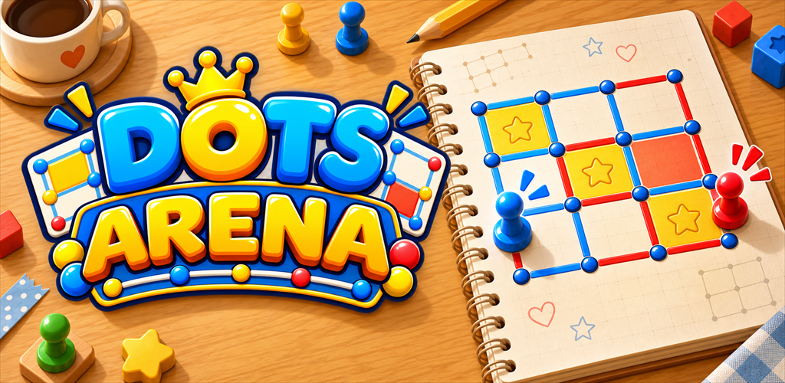

# Dots Arena



> 점을 잇고, 승리를 완성하세요!

**Dots Arena**는 점과 점 사이에 선을 그어 사각형을 완성하고, 상대보다 더 많은 영역을 차지하는 모바일 전략 보드게임입니다. 규칙은 간단하지만 어떤 선을 먼저 선택하고 상대에게 연속 득점 기회를 내주지 않을지 판단해야 하는 전략적인 플레이가 핵심입니다.

## 게임 개요

| 항목 | 내용 |
| --- | --- |
| 장르 | 캐주얼 전략 보드게임 |
| 플랫폼 | Android |
| 플레이 방식 | 실시간 온라인 1:1 / 로컬 2인 |
| 엔진 | Unity 6 |
| 개발 언어 | C# |
| 버전 | 1.0.0 |

## 게임 규칙

게임은 4×4개의 사각형으로 구성된 보드에서 진행됩니다.

1. 두 플레이어가 번갈아 인접한 점 사이의 선을 선택합니다.
2. 선택한 선을 확인하면 해당 위치에 자신의 선이 그려집니다.
3. 사각형의 네 번째 선을 완성한 플레이어가 그 영역과 1점을 획득합니다.
4. 영역을 획득한 플레이어는 턴을 넘기지 않고 한 번 더 진행합니다.
5. 보드의 모든 영역이 완성되면 게임이 종료되며, 더 많은 영역을 차지한 플레이어가 승리합니다.

단순히 눈앞의 영역을 완성하는 것뿐 아니라, 상대에게 여러 영역을 연속으로 내주지 않도록 선의 순서를 설계하는 것이 중요합니다.

## 게임 모드

### 빠른 매칭

Google 계정으로 로그인한 뒤 다른 플레이어와 실시간 1:1 대전을 진행합니다. 매칭이 완료되면 양쪽 플레이어의 준비 상태를 확인하고 같은 시점에 게임을 시작합니다.

온라인 대전 중에는 양쪽 화면의 선, 영역, 점수와 현재 턴이 동일하게 유지되며, 상대가 선택 중인 선도 미리 확인할 수 있습니다.

### 로컬 2인 대전

한 대의 기기를 두 명이 함께 사용하여 대전할 수 있습니다. 별도의 매칭 대기 없이 같은 게임 규칙과 보드에서 바로 플레이할 수 있으며, 현재 플레이어의 턴을 화면에서 구분해 보여줍니다.

## 핵심 기능

- **선택과 확정 입력**: 선을 먼저 미리 본 뒤 확인 버튼으로 최종 선택합니다.
- **실시간 상대 미리보기**: 온라인 상대가 현재 선택한 선을 반투명한 색상으로 표시합니다.
- **영역 획득과 연속 턴**: 사각형을 완성하면 점수를 얻고 이어서 다음 선을 선택합니다.
- **경기 정보 HUD**: 현재 턴, 남은 시간, 플레이어별 점수와 연결 상태를 표시합니다.
- **결과 화면**: 최종 점수에 따라 승리, 패배 또는 무승부 결과를 구분합니다.
- **Google 로그인**: Google 계정을 이용해 로그인하고 게임 내에 플레이어 닉네임을 표시합니다.
- **모바일 UI**: 세로 화면과 기기별 Safe Area를 고려한 인터페이스를 제공합니다.
- **사운드 설정**: BGM과 효과음을 각각 켜거나 끌 수 있으며 설정값을 저장합니다.
- **게임 피드백**: 선 선택, 영역 획득과 UI 조작에 맞춰 시각·청각 피드백을 제공합니다.

## 플레이 흐름

```text
게임 시작
   ↓
Google 로그인 및 프로필 확인
   ↓
로비에서 빠른 매칭 또는 로컬 2인 선택
   ↓
매칭 및 게임 준비
   ↓
4×4 보드 대전
   ↓
최종 점수와 경기 결과 확인
   ↓
로비로 이동
```

## 구현 특징

### 게임 규칙과 화면의 분리

보드 생성, 선 확정, 영역 획득, 점수 계산과 턴 변경 규칙을 Unity 화면 코드와 분리했습니다. 같은 규칙을 로컬 대전과 온라인 대전에서 함께 사용하므로 플레이 방식이 달라도 동일한 판정 기준을 유지합니다.

### 일관된 경기 상태 관리

현재 보드, 선과 영역의 소유자, 점수, 턴과 경기 결과를 하나의 경기 상태로 관리합니다. 화면은 전달받은 상태를 기준으로 갱신하여 두 플레이어가 같은 진행 상황을 확인할 수 있도록 구성했습니다.

### MVP 기반 UI 구성

로비, 게임 보드, 일시정지와 결과 UI를 Model, View, Presenter 역할로 나누었습니다. 데이터와 화면 표시, 사용자 입력 처리를 분리하여 각 기능의 책임을 명확하게 구성했습니다.

### 모바일 환경 대응

1080×1920 세로 화면을 기준으로 UI를 구성하고, 다양한 화면 비율과 카메라 홀 영역에 대응할 수 있도록 Safe Area를 적용했습니다. 게임 보드는 화면 크기가 달라져도 정사각형 비율을 유지합니다.

## 주요 기술

- Unity 6 `6000.3.20f1`
- C# 기반 게임 로직
- Google Play Games 로그인
- 비동기 매칭 및 실시간 경기 상태 동기화
- MVP 패턴 기반 UI
- Android Safe Area 대응
- BGM 플레이리스트와 효과음 시스템
